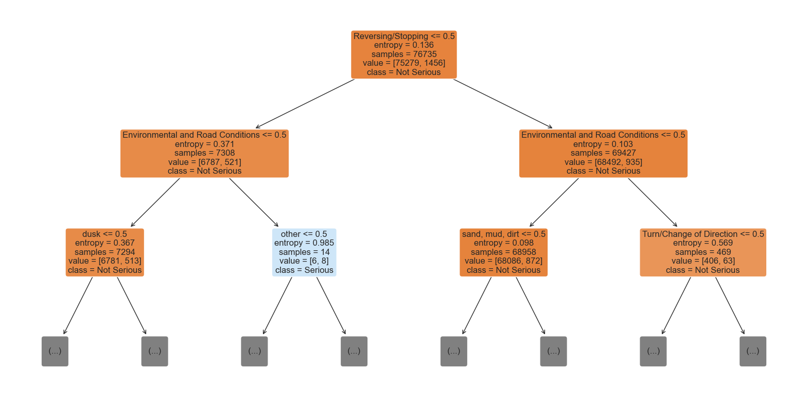
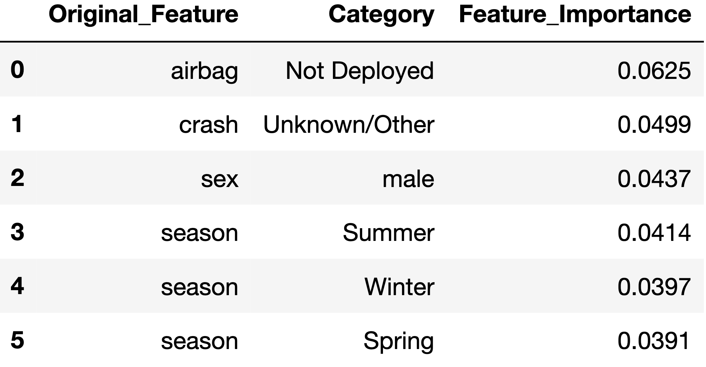

# Chicago Car Crash Analysis
Author: [Chris Kucewicz](https://www.linkedin.com/in/chriskucewicz/)
  
Full project in the Jupyter Notebook [here](https://github.com/ckucewicz/traffic_crash_prediction/blob/main/notebook.ipynb)
Project presentation [here](https://github.com/ckucewicz/traffic_crash_prediction/blob/main/presentation.pdf)

## Overview
This project analyzes traffic crash data from Chicago's Open Data Portal to identify patterns and factors contributing to fatal and serious vehicle crashes. By leveraging datasets on crash incidents, involving people, and vehicles, the analysis provides actionable insights into high-risk conditions and behaviors. The results aim to inform public safety initiatives and reduce traffic incidents through data-driven decisions.

*Photo by [Sawyer Bengtson](https://unsplash.com/@sawyerbengtson) on Unsplash*
___
## Business Understanding

### Background
In 2023, Chicago recorded 136 traffic deaths ([CDOT, 2024](https://api.chicago.gov/filenet5/servlets/getDocumentContent?applicationId=CompleteStreets&documentId=%7B60FB7292-0000-CB1B-AC4D-334F5F94606B%7D)), a sobering reminder of the persistent challenges the city faces in ensuring road safety. Despite efforts from various cities across the U.S., traffic fatalities continue to be a major issue. In response, Chicago introduced its [Vision Zero](https://visionzeronetwork.org/about/what-is-vision-zero/) Action Plan in June 2017, committing to the shared goal of eliminating traffic fatalities and serious injuries on the city’s streets by 2026 ([Vision Zero Chicago Action Plan, 2017](https://api.chicago.gov/filenet5/servlets/getDocumentContent?applicationId=CompleteStreets&documentId=%7B0031C690-0000-C016-92E9-31618D7320B1%7D)).

Traffic safety is not only a public health issue but also an equity concern, as Black and Brown communities, particularly in cities like Chicago and Philadelphia, suffer disproportionately from traffic fatalities.  In Philadelphia, zip codes with higher poverty rates see more crash hospitalizations ([City of Philadelphia, 2024](https://visionzerophl.com/plans-and-reports/annual-report-2024/)). These communities often face underinvestment in infrastructure, compounding the challenges they face in reducing fatalities and injuries.

Experts agree traffic fatalities are preventable. The Vision Zero Chicago Action Plan emphasizes that crashes are “predictable and preventable” events, with speed being a leading factor in severe accidents ([Vision Zero Chicago Action Plan, 2017](https://api.chicago.gov/filenet5/servlets/getDocumentContent?applicationId=CompleteStreets&documentId=%7B0031C690-0000-C016-92E9-31618D7320B1%7D)). Reducing speed is critical but requires addressing driver behavior through strategies like speed cushions, narrower lanes, and lower speed limits—though their effectiveness is debated.

Through my involvement with the City of Philadelphia’s Vision Zero Ambassadors program, I gained valuable experience engaging underserved communities, raising awareness, and understanding the importance of data-driven interventions to reduce fatalities. This role provided me with strong domain knowledge of traffic safety which I was able to utilize throughout the course of this project. 
### Goals
The goal of this project is to use crash data from CDOT's Open Data Portal to develop an *inferential* model that predicts whether a crash resulted in serious injuries. For the purposes of this project, ‘serious’ injuries refer to both fatalities and ‘incapacitating’ injuries. CDOT defines incapacitating injuries as: *'injuries that prevent an individual from walking, driving, or performing normal activities'*.

With the focus on using the model's predictions to identify contributing factors in serious crashes, this project is inherently attempting to verify CDOT’s claim that speed is a key factor in the severity of crashes, as outlined in their [2024 Annual Traffic Report](https://api.chicago.gov/filenet5/servlets/getDocumentContent?applicationId=CompleteStreets&documentId=%7B60FB7292-0000-CB1B-AC4D-334F5F94606B%7D). By analyzing speed alongside other factors such as road conditions, road design, enforcement, and vehicle type and size, the model will provide valuable insights into how these elements contribute to traffic fatalities and serious injuries.

An *inferential* model will be designed to be easily interpretable, meaning it will provide clear and understandable explanations for how it arrives at its predictions. This is crucial for decision-makers, as it allows them to trust the model’s results and use it to guide traffic safety policies and resource allocation. An easily interpretable model will help agencies like CDOT, the Chicago Metropolitan Agency for Planning (CMAP), Cook County Department of Transportation and Highways (CCDoTH), target resources more effectively, allow policymakers to evaluate the impact of different safety strategies, and help make informed decisions about where to focus their efforts. Ultimately, this model will assist in making data-driven decisions that reduce fatalities and improve the overall safety of Chicago’s roadways.

### Success Criteria
The success of this project will be measured by how effectively the model explains its predictions and identifies key features driving serious crashes. Due to the significant class imbalance, where serious crashes are much less frequent than non-serious ones, traditional metrics like accuracy are not suitable. 

Instead, the focus will be on Precision-Recall Area Under the Curve (PR AUC), which better evaluates performance for the minority class—serious crashes. This is crucial given the significant class imbalance. By focusing on the minority class, the PR curve helps diagnose the model’s ability to identify serious crashes, balancing precision and recall. Additional metrics, such as recall, precision, and the confusion matrix, will be used for further evaluation. However, PR AUC will guide model optimization and selection.

By optimizing PR AUC, this project aims to help local government and planning agencies, such as CDOT, CMAP, and CCDoTH identify key contributors to serious crashes and improve data-driven decision-making for traffic safety.
## Data Understanding
The data for this project came from the city of [Chicago's Data Portal](https://data.cityofchicago.org/). The datasets involved are updated regularly, with the most recent update on Dec 12, 2024, and the earliest recorded data dating back to March 2017. More on each dataset:
1. [Traffic Crashes - Crashes](https://data.cityofchicago.org/Transportation/Traffic-Crashes-Crashes/85ca-t3if/about_data): Contains detailed information about each traffic crash that occurred within the City of Chicago.
    * Total of **901k** observations with **48** features.
        * Includes fields such as crash date, crash location, weather conditions, road conditions, and contributing factors like speed limits.
    * Unique identifier for each crash is the `CRASH_RECORD_ID`.
    * Target class: `MOST_SEVERE_INJURY`
        * Includes 5 classes: 
             * *NO INDICATION OF INJURY*
             * *NONINCAPACITATING INJURY*
             * *REPORTED, NOT EVIDENT*
             * *INCAPACITATING INJURY*
             * *FATAL*
  

2. [Traffic Crashes - People](https://data.cityofchicago.org/Transportation/Traffic-Crashes-People/u6pd-qa9d/about_data): Provides information about individuals involved in a traffic crash, including details about their injuries 
    * Total of **1.98M** observations with **29** features.
        * Each record corresponds to an occupant in a vehicle listed in the Crash dataset, and it includes data such as the type of injury, role (driver, passenger, pedestrian, etc.), and whether the individual sustained any injuries.
    * Links to `Crash` dataset using the `CRASH_RECORD_ID` and `Vehicles` using `VEHICLE_ID`. 
    * Unique identifier for each person: `PERSON_ID` 
  

3. [Traffic Crashes - Vehicles](https://data.cityofchicago.org/Transportation/Traffic-Crashes-Vehicles/68nd-jvt3/about_data): Contains information about the vehicle(s) involved in traffic crashes. 
   
    * Total of **1.84M** observations with **71** features.
        * Each “unit” involved in a crash (e.g., motor vehicles, bicycles, pedestrians) is assigned a record. 
        * Information about the vehicle type, damage, and trajectory, as well as the relationship with the individuals involved (drivers, passengers, pedestrians).
        
    * Links to the `Crash` and `People` datasets using the `CRASH_RECORD_ID`. 
    
    

### Data Preparation
For streamlined reproducibility, the data cleaning process was completed in `data_cleaning_notebook.ipynb`. The final cleaned dataset, `crashes_finalized_df`, has been uploaded to Kaggle for easy access. For more detailed information on my data cleaning steps and justifications, please refer to the [data_cleaning_notebook.ipynb](https://github.com/ckucewicz/traffic_crash_prediction/blob/main/data_cleaning_notebook.ipynb).
 
#### **Overview of Data Preparation Steps**

With such a massive dataset, cleaning was critical to reduce noise, ensure accuracy, and prepare the data for analysis. Key steps included:
1. **Data Cleaning**: Inspected the structure of each dataset (crashes_df, people_df, vehicles_df), formatted feature names and values, removed features with excessive nulls, and resolved duplicates.

2. **Feature Refinement**: Reduced feature cardinality through label reclassification and dropped uninformative or redundant columns to focus the analysis.

3. **Aggregating for Crash-Level Analysis**: Aggregated people_df and vehicles_df to avoid many-to-many relationships, ensuring accurate feature representation when merged with crashes_df.

4. **Target Variable Adjustment**: Simplified the target variable (most_severe_injury) into a binary classification for serious vs. non-serious injuries, focusing the modeling on significant crash outcomes.

5. **Stratified Sampling**: Created a balanced subset of over 600,000 records for efficient analysis, maintaining the proportional distribution of the target variable classes.

#### **Final Cleaned Dataframe Overview**:
   * Subset of merged data from `crashes_df`, `people_df`, and `vehicles_df`
   * ***15***% random sample, keeping target class proportional with merged dataset
   * Total of approximately ***96k*** records and ***16*** features
   * Ready for modeling -- no null values

## Exploratory Data Analysis
Since the dataset focuses solely on crash incidents and lacks data on all vehicle trips (including safe ones), it’s impossible to directly compare features across serious crashes and all vehicle trips. As a workaround, I compared the percentage of features in serious crashes against their percentage in both serious and non-serious crashes combined. This approach helped identify features that are disproportionately represented in serious crashes, suggesting they may play a role in predicting severe crash outcomes.
### Key findings:
#### 1. Overrepresented Categories in Serious Crashes:
* **Sex**: 

Males are overrepresented in serious injuries, accounting for **54.4**% of serious injuries, despite comprising **47.8**% of total injuries.

* **Lighting Condition**: 

Crashes occurring in darkness with lighted roads are overrepresented in serious injuries, accounting for **30.4**% of serious injuries, compared to only **22.0**% of total injuries.

* **Airbag Deployment**: 

Airbags are deployed in **35.4**% of serious injury crashes, compared to **9.5**% of total injuries, suggesting that airbag deployment may serve as a proxy for factors such as vehicle size or speed, indicating higher impact forces in serious crashes.
 

    

#### 2. Proxies for Speed as a Contributing Factor:

* **Road Speed Limits**: 

Roads classified as having ‘slow’ speed limits (< 25 mph) show disproportionately fewer serious crashes, while roads with ‘medium’ speed limits (26-40 mph) are overrepresented in serious crashes.
 

* **Aggressive/Reckless Driving**: 

Causes of crashes classified as aggressive/reckless driving (e.g., speeding, tailgating, improper passing) account for 55% of serious crashes.

* **Airbag Deployment as a Proxy**: 

Airbag deployment, which is more prevalent in serious injury crashes, may serve as a proxy for crash severity, reflecting higher impact forces typically associated with higher speeds or larger vehicles.

## Modeling
During the modeling phase, I followed standard steps but focused on addressing two key challenges:
### 1. **Developing an Interpretable Inferential Model**
* I prioritized models like logistic regression and decision trees, which are considered white-box models. These models offer transparency and ease of interpretation, enabling a clear understanding of how predictions are made—an essential factor for inferential analysis.

### 2. **Addressing Class Imbalance in the Target Variable (`severity_category`)**
* To mitigate the impact of imbalanced classes, I implemented two techniques:
    * Oversampling with SMOTE (Synthetic Minority Oversampling Technique): SMOTE generates synthetic samples for the minority class by interpolating between existing samples, improving representation in the dataset. However, limitations include potential overfitting to synthetic data.
    

* Adjusting Class Weights: By increasing the penalty for misclassifying minority class samples, this technique naturally shifts model focus towards the minority class. A limitation is the risk of reduced performance on the majority class.

### 3. **Evaluating Model Performance**

* Given the class imbalance in the target variable, accuracy was not a reliable metric, as it could be misleadingly high by favoring the majority class. Instead, I used Precision-Recall Area Under the Curve (PR AUC) to evaluate models. PR AUC focuses on the balance between precision (correctly identified positives) and recall (coverage of actual positives), making it a more suitable metric for imbalanced classification tasks. It highlights the model’s ability to predict the minority class effectively without being biased by the majority class.

### **Steps in Modeling**
#### 1.	**Train-Test Splits**:
* An initial split to avoid data leakage (train and test sets).

* A secondary split for validation, ensuring a hold-out test set for final model evaluation on unseen data.

#### 2. **Evaluation Function**:
* Designed to compute PR AUC values and visualize the PR AUC curve for a comprehensive evaluation.

#### 3.	**Baseline Models**:
* Trained and evaluated simple logistic regression and decision tree models using preprocessing steps like one-hot encoding for categorical variables.

#### 4.	**Addressing Class Imbalance**:
Developed and compared four models to evaluate the effectiveness of different techniques for handling imbalanced data:

   * ***Logistic regression with SMOTE***: Used to balance the dataset by generating synthetic samples for the minority class.
    
   * ***Logistic regression with SMOTE and class weights***: Combined oversampling with a weighting strategy to further enhance focus on the minority class. 
    
   * ***Decision tree with SMOTE***: Applied oversampling to a more interpretable, tree-based model.
    
   * ***Decision tree with SMOTE and class weights***: Combined oversampling with weighted classes to optimize performance.

This approach allowed for a thorough assessment of how these methods interact and impact model performance, particularly in predicting minority class outcomes.

#### 5.	**Hyperparameter Tuning**:

* Used GridSearchCV with cross-validation to optimize class weights for logistic regression and decision tree models.

* Compared all models, evaluating their performance using PR AUC.

### Final Model Selection

After comparing the performance of all trained models, the baseline decision tree emerged as the best-performing model. This model’s simplicity and strong performance made it the most suitable choice for this project.

More details on the best model’s performance and interpretive insights are provided in the evaluation phase.

## Evaluation
The predictive performance of my models was generally low, with the best-performing baseline decision tree model achieving a PR AUC of 0.0956 on validation data (where a PR AUC score of 1 represents perfect performance). This could be due to significant class imbalance or suboptimal feature selection during the data preparation phase.

However, the main focus of this project was on model inference rather than predictive accuracy. The goal was to understand how the model makes predictions in order to help identify key contributing factors in serious (fatal or incapacitating) traffic crashes. Decision trees are ideal for this type of analysis because they are simple, interpretable, and provide insights into feature importance.

Entropy is a measure of the uncertainty or impurity in a dataset. When a decision tree splits the data based on a feature, it seeks to reduce the entropy in the resulting subsets. The more a feature helps to reduce uncertainty, the more important it is in making decisions. Information gain is the reduction in entropy when a feature is used to split the data. A higher information gain indicates that the feature is more effective at clarifying the target variable’s behavior.

The feature_importances_ attribute in decision trees ranks features based on how much they reduce entropy across the tree. Features with higher importance scores are those that provide more significant reductions in uncertainty, helping the model make more confident predictions. Unlike linear regression coefficients, feature importance scores in decision trees do not convey the direction or magnitude of the effect on the target variable, but instead reflect their contribution to reducing uncertainty.

Based on the decision tree model, the most important features for predicting serious car crashes were:
   1. **Airbag Deployment (‘Not Deployed’)**
   2. **Crash Cause Category (‘Unknown/Other’)**: Although significant in the model, this feature offers little actionable insight.
   3. **Sex (‘Male’)**
   4. **Seasonality (Summer, Winter, and Spring)**

I’ll elaborate on each of these features below, as they will inform the recommendations in the conclusion.
## Conclusion

### Limitations
1. **Data Quality: Police-Reported Data**

The quality of the model heavily depends on the data used, which in this case comes from police-reported records. There are two main issues with this:

   * **Potential Implicit Bias**: Police reports can be influenced by implicit bias, which may skew the results.

   * **Subjectivity and Delayed Reporting**: Police often arrive after a crash has occurred, meaning their reports are based on second-hand accounts and can be subjective. Additionally, individuals involved in the crash may not always provide accurate information.
    

2. **Decision Tree Interpretation**

While decision trees excel at identifying important features and ranking them by their contribution to the model, they do not provide a direct understanding of the magnitude or direction of a feature’s effect on the target variable. Unlike linear regression, where changes in a predictor can be interpreted as affecting the target in a specific way (e.g., increasing by a set amount), decision trees offer an ordinal ranking of features but don’t give us insights into how changes in those features quantitatively affect the target variable.

3. **Computing and Time Constraints**

Due to the quick turnaround time for this project, the focus was on delivering a deployable minimum viable product. As a result, some decisions made during the data cleaning and modeling phases, such as feature selection, model choice, and hyperparameter tuning, were constrained by time. More time could have allowed for more refined selections and optimizations.
### Recommendations
### 1. **Male Trends Analysis**:
The analysis revealed that males were disproportionately represented in serious injury crashes, accounting for **54.4**% of serious injuries despite comprising **47.8**% of total injuries. However, it’s important to note that the data does not distinguish whether males were the drivers or passengers in these situations.

#### **Recommendations**:

***Further Analysis***: Conduct additional research to determine whether this trend persists when focusing specifically on male drivers.

***Targeted Safety Campaign***: If the trend is verified for male drivers, develop a targeted safety campaign aimed at addressing behaviors linked to higher risk, such as speeding and aggressive driving. This campaign could utilize public service announcements, social media outreach, and partnerships with local organizations to encourage safer driving habits.
    

### 2. **Vehicle Size and Speed Regulations**:
One of the key findings of this analysis is that airbag deployment (or lack thereof) is a key contributing factor in the injury severity of a crash. Airbags deploy based on the force of impact, which is significantly influenced by vehicle speed and size. Larger, heavier vehicles such as trucks and SUVs contribute to more severe crashes due to the greater forces involved, increasing the likelihood of airbag deployment.

#### **Recommendations**:

**City-Specific Weight Fees**: Introduce a tiered fee system for parking permits or vehicle registrations within Chicago, where heavier personal vehicles like trucks and SUVs incur higher fees. This financial disincentive could encourage the use of smaller, safer, and more environmentally friendly vehicles in city settings.

**Revenue Allocation**: Allocate revenue from these fees to fund pedestrian and cyclist safety initiatives, such as traffic calming measures, better signage, and crash prevention campaigns.

**Speed-Limiting Systems**: Advocate for regulations that require or incentivize the use of speed-limiting technology in vehicles. These systems can restrict maximum vehicle speeds to safer limits, reducing the likelihood and severity of crashes.

### 3. **Annual Airbag Inspections**:
Airbag deployment was identified as the most important feature in predicting injury severity, highlighting its importance in crash safety. To ensure airbags function effectively, especially in older vehicles, regular inspection and maintenance are crucial.

#### **Recommendation**:
Advocate for policies requiring annual airbag inspections, ensuring they are functional and compliant with modern safety standards.
### Next Steps
Based on the findings, speed—either directly or indirectly—appears to contribute to serious crashes. This raises the critical question: ***How do we encourage drivers to slow down?*** Addressing this behavior change is a complex challenge, and I’m eager to explore this further.

Additionally, I’m interested in delving into the overrepresentation of males in serious crashes. I plan to focus on male drivers specifically to ***see if this trend holds and, if so, explore the potential reasons for this disparity***.
## Additional Information

View the full project in the Jupyter Notebook [here](https://github.com/ckucewicz/). 
  
View the project presentation [here](https://github.com/ckucewicz/traffic_crash_prediction/blob/main/presentation.pdf)

Contact Chris Kucewicz at [cfkucewicz@gmail.com](cfkucewicz@gmail.com) with additional questions.

## Repository Structure

traffic_crash_prediction/
│
├── images/                   # Directory containing all images used in the project
│   ├── decision_tree_plot.png    # Example: Decision tree visualization
│   ├── dt_feature_importances.jpg # Example: Feature importance plot
│   └── ...                      # Additional project-related images
│
├── .gitignore                # File specifying untracked files to be ignored by Git
├-    README.md                 # Project documentation
├── data_cleaning_notebook.ipynb  # Notebook for data cleaning and preprocessing
├── notebook.ipynb            # Main notebook for analysis and modeling
├── presentation.pdf          # Final presentation of the project findings
