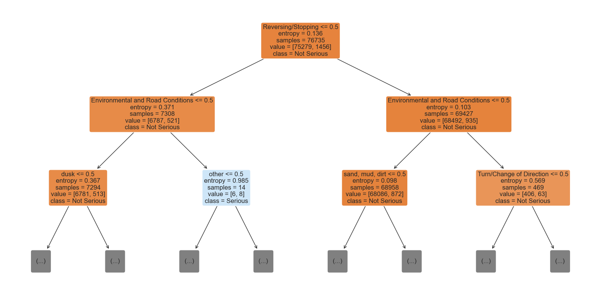

# Chicago Car Crash Prediction  
*Machine Learning Case Study by Chris Kucewicz*

> Real-world classification project predicting serious injuries in Chicago traffic crashes using interpretable models on imbalanced, messy public data.

**Tech Stack:** Python, Pandas, scikit-learn, imbalanced-learn (SMOTE), GridSearchCV, Jupyter

**[GitHub Repository](link_to_repo)**

---

## Problem & Objective

Can we predict whether a traffic crash results in serious injury — and understand why?

Using 900K+ crash records from Chicago’s Open Data Portal, this project predicts *serious injury outcomes* (fatal or incapacitating) to support data-driven traffic safety policy. The goal was not just prediction, but **interpretation** — building a model that can inform real-world decision-making.

---

## ML Problem Framing

- **Task:** Binary classification – Serious Injury vs. Non-Serious Injury  
- **Target:** `most_severe_injury` → recoded as binary  
- **Challenge:** Class imbalance (~5% serious injury)  
- **Goal:** Use interpretable, policy-relevant models  
- **Data Sources:** Crash, Vehicle, and People datasets (merged)

---

## Modeling Pipeline

| Step                    | Approach / Tool              |
|-------------------------|------------------------------|
| Baseline Models         | Logistic Regression, Decision Tree |
| Imbalance Handling      | SMOTE (oversampling), Class Weights |
| Evaluation Metric       | Precision-Recall AUC (PR AUC) |
| Hyperparameter Tuning   | GridSearchCV (on class weights) |
| Final Model             | **Decision Tree** (PR AUC = 0.096) |

---

## Feature Insights

| Feature                | Insight                                                  |
|------------------------|-----------------------------------------------------------|
| **Airbag Deployment**  | Top predictor; likely a proxy for high-speed or large-vehicle impacts |
| **Sex (Male)**         | Overrepresented in serious injuries (54% vs. 47.8%)       |
| **Crash Cause**        | High gain, though often “Unknown/Other”                  |
| **Season (Winter/Summer)** | Seasonal extremes associated with elevated risk        |

  
*The decision tree revealed interpretable splits based on driver sex, airbag deployment, and seasonality.*

---

## What This Project Demonstrates

- Handling real-world **imbalanced classification** with appropriate metrics (PR AUC)  
- Use of **interpretable models** (white-box over black-box)  
- Practical feature engineering: merging 3 datasets into crash-level records  
- ML for **public good**: policy-relevant, equity-aware analysis  
- Full workflow: data prep → modeling → evaluation → insights

---

## Next Steps

- Explore ensemble models with **SHAP** for interpretability  
- Refine feature engineering (e.g., separate driver vs. passenger sex)  
- Compare with statistical models (e.g., Poisson/Negative Binomial)  

---

## Policy-Relevant Takeaways

- **Male involvement** and **mid-speed roads** are linked to serious crashes  
- **Airbag deployment** (as a proxy for high-impact collisions) was the strongest predictor  
- Findings support **targeted safety campaigns**, **vehicle weight regulations**, and **airbag inspection policies**

---

[Full Jupyter Notebook](link_to_notebook.ipynb)  
[Presentation Slides](link_to_presentation.pdf)  
[GitHub Repo](link_to_repo)  
Contact: cfkucewicz@gmail.com
