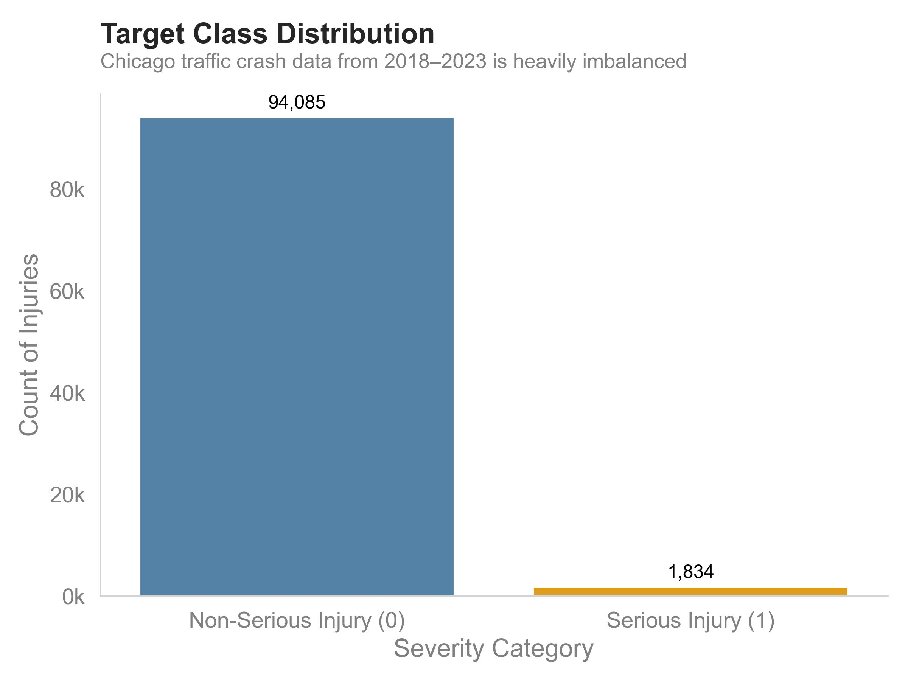

*Machine Learning Case Study by Chris Kucewicz*

> Real-world classification project predicting serious injuries in Chicago traffic crashes using interpretable models on imbalanced, messy public data.

**Tech Stack:** Python, Pandas, scikit-learn, imbalanced-learn (SMOTE), GridSearchCV

**[GitHub Repository](https://github.com/ckucewicz/traffic_crash_prediction)**

---

## Problem & Objective

Can we predict whether a traffic crash results in serious injury — and understand why?

Using 900K+ crash records from Chicago’s Open Data Portal, this project predicts *serious injury outcomes* (fatal or incapacitating) to support data-driven traffic safety policy. The goal was not just prediction, but **interpretation** — building a model that can inform real-world decision-making.

Data sources:
* [Traffic Crashes - Crashes](https://data.cityofchicago.org/Transportation/Traffic-Crashes-Crashes/85ca-t3if/about_data)
* [Traffic Crashes - People](https://data.cityofchicago.org/Transportation/Traffic-Crashes-People/u6pd-qa9d/about_data)
* [Traffic Crashes - Vehicles](https://data.cityofchicago.org/Transportation/Traffic-Crashes-Vehicles/68nd-jvt3/about_data)

---

## ML Problem Framing

- **Task:** Binary classification – Serious Injury vs. Non-Serious Injury  
- **Target:** `most_severe_injury` → recoded as binary  
- **Challenge:** Class imbalance (~5% serious injury)  
- **Goal:** Use interpretable, policy-relevant models  
- **Data Sources:** Crash, Vehicle, and People datasets (merged)

*Serious injuries account for less than 5% of all crashes, highlighting a significant class imbalance in the dataset. To address this, the modeling pipeline used oversampling with SMOTE and class weighting to improve recall for serious injury predictions.*

---

## Modeling Pipeline

| Step                    | Approach / Tool              |
|-------------------------|------------------------------|
| Baseline Models         | Logistic Regression, Decision Tree |
| Imbalance Handling      | SMOTE (oversampling), Class Weights |
| Evaluation Metric       | Precision-Recall AUC (PR AUC) |
| Hyperparameter Tuning   | GridSearchCV (on class weights) |
| Final Model             | **Decision Tree** (PR AUC = 0.096) |

Explore the full modeling process, from data prep to evaluation, in the notebook. View it [here](https://github.com/ckucewicz/traffic_crash_prediction/blob/main/notebook.ipynb).

---

## Feature Insights

| Feature                | Insight                                                  |
|------------------------|-----------------------------------------------------------|
| **Airbag Deployment**  | Top predictor; likely a proxy for high-speed or large-vehicle impacts |
| **Sex (Male)**         | Overrepresented in serious injuries (54% vs. 47.8%)       |
| **Crash Cause**        | High gain, though often “Unknown/Other”                  |
| **Season (Winter/Summer)** | Seasonal extremes associated with elevated risk        |

## Decision Tree Plot of Final Model

*The decision tree revealed interpretable splits based on driver sex, airbag deployment, and seasonality.*

## Top Feature Importances from Decision Tree Model

| Feature     | Category        | Importance |
|-------------|------------------|------------|
| Airbag      | Not Deployed     | 0.0625     |
| Crash Type  | Unknown/Other    | 0.0499     |
| Sex         | Male             | 0.0437     |
| Season      | Summer           | 0.0414     |
| Season      | Winter           | 0.0397     |
| Season      | Spring           | 0.0391     |

*The model prioritized contextual and driver-related features. Injury severity was more likely when airbags did not deploy, crashes occurred in less favorable seasons, or the driver was male. These results provide interpretable insights aligned with known crash risk factors.*
 

---

## Policy-Relevant Takeaways

- **Male involvement** and **mid-speed roads** are linked to serious crashes  
- **Airbag deployment** (as a proxy for high-impact collisions) was the strongest predictor  
- Findings support **targeted safety campaigns**, **vehicle weight regulations**, and **airbag inspection policies**

---

## What This Project Demonstrates

- Handling real-world **imbalanced classification** with appropriate metrics (PR AUC)  
- Use of **interpretable models** (white-box over black-box)  
- Practical feature engineering: merging 3 datasets into crash-level records  
- ML for **public good**: policy-relevant, equity-aware analysis  
- Full workflow: data prep → modeling → evaluation → insights

---

## Next Steps

- Explore ensemble models with **SHAP** for interpretability  
- Refine feature engineering (e.g., separate driver vs. passenger sex)  
- Compare with statistical models (e.g., Poisson/Negative Binomial)  

---

[Full Jupyter Notebook](https://github.com/ckucewicz/traffic_crash_prediction/blob/main/notebook.ipynb) |
[Presentation Slides](https://github.com/ckucewicz/traffic_crash_prediction/blob/main/presentation.pdf) |
[GitHub Repo](https://github.com/ckucewicz/traffic_crash_prediction) |
Contact: cfkucewicz@gmail.com
